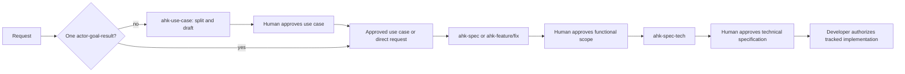
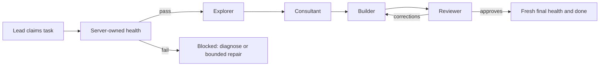

# @cardor/agent-harness-kit

Agent Harness Kit (AHK) gives AI coding providers a shared workflow for documents, tracked tasks, handoffs, and health evidence. It supports Claude Code, Codex CLI, Cursor, Grok Build, and OpenCode.

AHK supplies structure and records. Your provider supplies the model and its own permissions; prompt instructions, including Codex instructions, are not a security boundary.

```bash
pnpm add -g @cardor/agent-harness-kit
# or: npm install -g @cardor/agent-harness-kit
# or: bun add -g @cardor/agent-harness-kit
# Yarn Classic (v1) only: yarn global add @cardor/agent-harness-kit

ahk init
```

Yarn Modern (Berry) removed `yarn global`; install AHK globally through pnpm, npm, or Bun instead.

For the complete offline product guide after installation, ask: “Use `ahk-docs` to explain how AHK works.” The same bundled guide is in [the source skill](src/core/materializer/skills/ahk-docs/SKILL.md).

## Choose a workflow

Ask explicitly for a skill when predictable routing matters. Natural-language routing can help, but provider skill selection is not guaranteed.

| What you need | Ask for | Produces | Does not do |
| --- | --- | --- | --- |
| Clarify one actor, goal, and result | `ahk-use-case` | Draft in `docs/use-cases/` | Architecture or implementation |
| Define functional scope | `ahk-spec` | Functional spec in `docs/specs/` | Technical design |
| Design implementation after approval | `ahk-spec-tech` | Linked technical spec | Implementation |
| Turn a pasted request into a feature or fix spec | `ahk-feature` / `ahk-fix` | Functional specification | Fetch Jira automatically |
| Diagnose a bug | `ahk-triage` | Evidence-backed report | Code changes |
| Ask about project code | `ahk-ask` | Read-only answer | Task state |
| Compare approaches | `ahk-consultant` | Read-only advice | Implementation |
| Write behavior tests only | `ahk-test` | Tests and evidence | Production/config/dependency changes |
| Preview a review | `ahk-review` | Review rubric | Official approval |
| Learn AHK itself | `ahk-docs` | Read-only product guide | Any mutation |

Examples:

```text
Use ahk-use-case to define passwordless sign-in for an existing account.
Use ahk-feature to turn this pasted Jira card into an approved functional spec; do not implement it.
Use ahk-triage to explain why checkout retries twice. Do not change code.
Use ahk-docs to explain the health gate and repair mode.
```

The lightweight skills above are useful entry points, not mandatory stages. `ahk-consultant` is a read-only skill; the consultant role below is part of tracked development.

## From idea to verified work



Start `ahk-use-case` for an unclear initiative. It asks one decision at a time and separates independent actor-goal-result scenarios into linked use cases. Each coherent draft is saved before explicit human approval. A well-defined request may begin with `ahk-spec`, `ahk-feature`, or `ahk-fix`. Technical specification follows only an approved functional source. Approval of a document does not authorize implementation.



The lead coordinates the five roles. A reviewer may send bounded feedback back to the builder. MCP owns the task claim, action log, handoffs, and final health result; the document files remain on the filesystem.

## Quick start

Run the globally installed `ahk init` in the current directory. It asks for provider, docs path, and storage choices, and creates a native health-script starter when one is missing. Replace that starter with commands that actually verify your project. A health script that always succeeds is not valid completion evidence.

Open or restart your provider after initialization so it reloads its MCP configuration. Claude Code uses the project-root `.mcp.json`; AHK also materializes native files for Codex, Cursor, Grok Build, and OpenCode.

Then make a bounded first request:

```text
Use ahk-feature to define a functional spec from this request. Save a draft, ask for approval, and do not create a task or implement code.
```

### Installation and storage

A globally installed `ahk` command and global database storage are different settings:

- A global CLI is the executable on your `PATH`.
- Global storage keeps the harness database in the user's harness home storage.
- Local storage commonly keeps it in `.harness/harness.db`.

`ahk init` does not create a home-directory provider scaffold. Agent and skill files it creates stay in the current project. The detailed setup and provider guide ships with [`ahk-docs`](src/core/materializer/skills/ahk-docs/resources/setup-and-providers.md).

## What AHK tracks

Specifications are Markdown artifacts: use cases live in `docs/use-cases/`; functional and technical specifications live in `docs/specs/`. Tasks, actions, acceptance evidence, and handoffs are harness data, normally backed by the configured database.

On a tracked task, `tasks.claim` runs native health. A pass enables normal work. A failure enters blocked mode: diagnosis remains available, while implementation needs a bounded, audited `tasks.repair.begin(...)` authorization. `tasks.update(..., 'done')` runs fresh final health and closes only when it passes.

Operational notices — lifecycle MCP responses, `ahk build`, `ahk sync`, and `ahk doctor` surface cached upgrade and generated-skill migration information without changing task or health results. Suggested commands require developer approval.

The full MCP and lifecycle guide is bundled in [`ahk-docs`](src/core/materializer/skills/ahk-docs/resources/mcp-and-lifecycle.md).


### MCP contracts in practice

MCP is the source of truth for active task lifecycle data. A tracked agent starts an action before it works, records evidence in sections, and completes that action with a bounded summary. The next role receives a canonical handoff instead of reconstructing the entire conversation.

For compact evidence reads, use `actions.list`, `actions.get_by_id`, `actions.sections.list`, and `actions.sections.get`; use `actions.handoff.get` and `actions.handoff.write` for recipient-directed transfer. The CLI helpers are `ahk task add`, `ahk task list`, `ahk task edit`, and `ahk task done <id|slug>`.

The useful division is simple:

| Information | Home | Why |
| --- | --- | --- |
| Use cases and specifications | `docs/` | Human-reviewable source documents |
| Tasks, actions, health runs, and handoffs | Harness data | Server-owned lifecycle evidence |
| Generated provider files and skills | Provider directories | Reproducible local integration |

The provider should use the installed MCP tool descriptions for exact names and arguments. Do not use a local JSON backlog or a hand-written adapter as the task source of truth.

### Roles and evidence

The lead scopes and coordinates a tracked task. The explorer maps relevant code without editing it. The consultant advises after exploration. The builder implements the approved plan. The reviewer verifies acceptance criteria, health, and evidence, then either approves or sends a focused correction back through the lead's workflow.

The health gate does not replace role verification. A green result proves only the native commands it ran. It does not prove deployment, a real device, an OTA update, a browser visual review, or any other unexecuted environment.

### Documents and approvals

Use `ahk-use-case` when the request needs discovery. One request may become several use cases when its actors, goals, or observable outcomes are independent. `ahk-spec` can link those approved use cases into a functional specification. `ahk-spec-tech` links an approved functional source to a technical design.

Feature and fix skills remain direct functional-spec entry points. They are useful when the supplied request is already specific enough. Paste ticket content into the conversation; AHK has no built-in Jira connector.

Draft persistence makes the evolving decision record reviewable. Explicit human approval moves a document forward. A developer still chooses when to authorize a task and implementation.

## Maintenance

Use `ahk build` after configuration changes. Use `ahk sync` for its project synchronization workflow. `ahk doctor` is read-only: it checks that agent files exist and byte-checks canonical skill files for missing or outdated content; it does not apply migrations.

Generated-skill migrations are versioned and project-local. They run in order and resume after interruption. Exact canonical AHK skill names and retired `ahk-use-cases` / `ahk-use-case-tech` are reserved: build/sync back up changed content before refreshing canonical files or removing retired trees, even after an applied migration checkpoint. Unknown skill names and extra files are preserved; symlinks are refused. Human-authored document migrations are explicit. Read [the maintenance guide](src/core/materializer/skills/ahk-docs/resources/maintenance.md) for details.

Network is optional for ordinary use. Update checks can run as cached maintenance notices; the CLI, MCP workflow, and bundled `ahk-docs` resources work offline.

### Model preferences

Some providers expose native per-agent model and reasoning controls. AHK records compatible selections during initialization and regenerates their provider-native form. Availability comes from the provider, account, model, and policy, so inspect the live picker rather than assuming every effort level or model ID exists everywhere.

The default role design favors a stronger planning and implementation model for lead, builder, reviewer, and consultant; exploration usually benefits from a cheaper, lower-effort model. These are defaults for an available provider catalog, not a guarantee that a particular model remains offered.

### Generated assets versus personal edits

`build` and `sync` refresh reserved canonical skill files from the packaged source and report backups under `.harness/backups/`. Extra files inside canonical skill directories remain unless a validated prior inventory proves they are stale generated files. Other skill names, including unknown `ahk-*` names, remain untouched. `doctor` only reports their state. Agent files keep their existing user-owned policy.

Keep your project configuration, specifications, and health script under normal version control. Treat database exports and provider configuration according to your team's secret and backup policy. The harness can be local-first while optional provider clients and update checks still make network requests.

## Compatibility and development

The package manifest currently declares Node `>=14`, but the default SQLite driver and the tested development flow target Node 22 or current Bun. Use Node 22 or current Bun until compatibility is aligned and verified.

```bash
pnpm test
pnpm typecheck
pnpm lint:check
```

Run the smallest relevant test while iterating, then the full suite before releasing a change that affects shared materialization. A passing static check does not prove generated files load in every provider, so validate the provider configuration you actually use.

### Keeping documentation accurate

Public onboarding belongs here. Detailed operating instructions belong in the resource-routed `ahk-docs` skill so installed users receive the same guide offline. The pages under `docs/` provide repository navigation and historical maintainer references; they should link to the skill guide rather than copy it.

When behavior changes, update the guide nearest to the behavior:

- update `workflows.md` for skill routing and approval boundaries;
- update `setup-and-providers.md` for initialization or provider materialization;
- update `mcp-and-lifecycle.md` for server contracts and health gates;
- update `maintenance.md` for build, sync, doctor, upgrades, or migrations.

This keeps a provider-neutral source while the materializer applies only the small provider-specific guidance needed by generated skills.

See the [documentation index](docs/index.md) for repository navigation and historical plans. The current operational guide has one maintained source: the resources bundled with `ahk-docs`.

## More help

- Ask `ahk-docs` about installation, providers, MCP, health, model preferences, or migrations.
- Ask `ahk-ask` about the code in the project you are currently working on.
- Use the issue tracker for defects in AHK itself and include the installed version, provider, generated-file path, and reproducible command.
- Read [SECURITY.md](SECURITY.md) before reporting a security issue.

## License

Apache-2.0. See [LICENSE](LICENSE).

The project is maintained as a local-first developer tool; confirm provider-specific behavior in the installed provider before adopting it in a team workflow.
